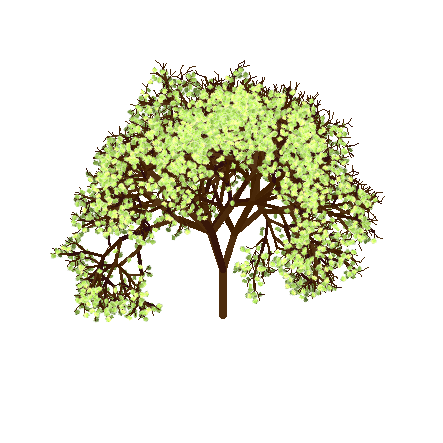
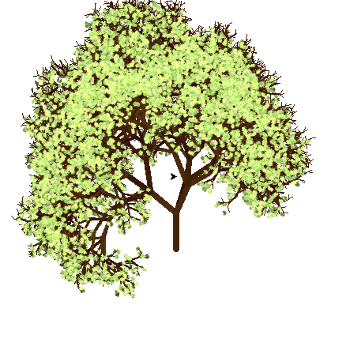

## TimoTree - A tree generator

This is a simple and highly customizable tree fractal generator for psychophysical experiments. 

### Requirements:
- python 2.7    
  - PIL  
  - turtle  
  - string  
  - os  
  - numpy  

### Examples

### Usage 
just call main.py from the command line! Numerous settings can be changed to alter the tree's appearance:

#### Basic Parameters 
	- numIters             : maximum number of iterations (=recursive calls)
	- treeColourBase       : colour of tree

#### Branches
##### Stem
	- numStem              : number of iterations without leaves
	- stemColourVari       : variability in colour of stem
	- stemLength           : length of stem
	- stemWidthFactor      : proportional width of stem
##### Angles
	- branchAngleBase      : angle between child edge and parent edge
	- branchAngleRange     : range of possible angles	
##### Colours
	- branchColourVari     : variability in colour of branches
##### Decrease
	- branchShrinkage      : reduction in branch-size on each iteration
	- branchShrinkageRange : range of shrinkage noise
	- branchWidthFactor    : proportional width of potentially leafy branch
	- branchMin            : minimum branch length	
##### Probabilities
	- probaLeftBranch      : branch to the left
	- probaStraightBranch  : proceed with straight line
	- probaRightBranch     : branch to the right

#### Leaves
##### Number, Size and Position
	- leafNum              : max Num of leaves per branch
	- leafSize             : size of leaf image
	- leafSizeVariance     : variance in leaf size
	- leafFractionBehind   : percentage of leaves that go behind tree
##### Brightness
	- leafMinBrightness    : minimal brightness of leaves
	- leafMaxBrightness    : maximal brightness of leaves
##### Probabilities	
	- probaFruit           : probability of fruit growth
	- probaLeaf            : probability of leaf growth